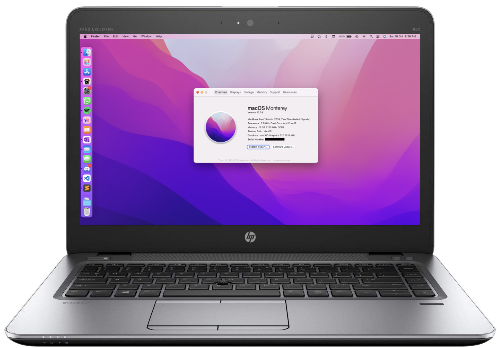

# Elitebook 840 G3 Hackintosh



Current Status: **Working**<br>
OS: macOS Moneterey (12.7.6)<br>
OC: September 2024 (1.0.1)

## What doesn't work

- Airdrop / Sidecar
- Trackstick and upper touchpad buttons [WIP]
- Network button on the keyboard
- Touchpag toggle button
- Connecting to personal iOS hotstops directly
  

## Untested

- Sim Card
- Smart Card Slot
- SD Card Slot
- Docking Port

## What works

- Literally Everything else

## Special Fixes

### Static Noise in Externally Connected Microphone

This is an issue where when you are using a headset (heaphone+mic) setup connected to the JAC and while the external output works, the external output seems to only pick up static.

In order to fix it, the `CodecCommander.kext` has been included in the config. All you need to do is run 

```
/pathto/hda-verb 0x19 SET_PIN_WIDGET_CONTROL 0x24
```
This fixes the routing to the combojack, therefore enabling the external microphone. You would have to run this everytime you reboot your machine.

I have included a script: `scripts/audiofix.command` which you can simply run everytime on boot.
